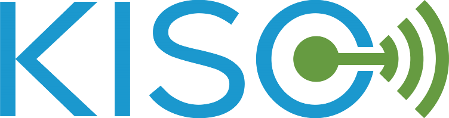

# Kiso #

## Introduction ##
Eclipse Kiso was designed from scratch as a software development kit (SDK) for IoT devices. It has been used for developing a handful of existing products in the market. Kiso's reusability, robustness and portability is a key factor that enables fast development and reduces time to market for almost all kinds of IoT "Things" product development.

## Quick start ##
Please take a look at [quick start](http://kiso.rempler.de:1313/3.-user-guide/quick_start/)

## Support ##
Community support is provided via Mattermost, see Kiso channel https://mattermost.eclipse.org/eclipse/channels/kiso
An Eclipse Foundation Mattermost account is needed.

## Resources ##
Please note that (for now) some of these links require additional accounts and/or are limited to Bosch infrastructure access. This is a temporary impediment until Kiso's infrastructure has been moved over to Eclipse Foundation.
* User manual: [documentation](http://kiso.rempler.de:1313/)
* Architecture: [architecture overview](http://kiso.rempler.de:1313/2.-concepts/overall_architecture/#overall-architecture)
* Frequently asked questions: [FAQ](http://kiso.rempler.de:1313/6.%20Frequently%20asked%20questions/)
* API documentation: [doxygen documentation](http://kiso.rempler.de:8080/)
* Release notes (inkl. features, supported reference HW and known issues): [release notes](https://github.com/Bosch-AE-SW/cddk-oss/blob/master/RELEASE_NOTES.md)
* Continuous integration (automated testing results): [Jenkins dashboard](https://rb-jmaas.de.bosch.com/software-campus/view/Kiso-Dashboard/)
