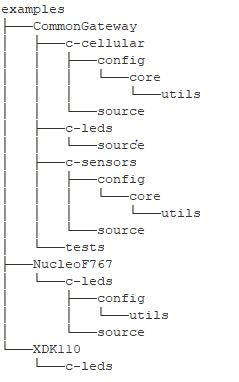

# Example Projects Documentation

Example projects are provided out of the box with Kiso so as to enable developers:
1. to straight away try out various features offered by Kiso without having to write a single line of code.
2. to implemenet their desired applications with appropriate adaptations to the example projects.

## Organization of the Examples Directory

1. The examples are and will be grouped on the basis of the develoment board. This results into directories with the name of the appropriate development board.
2. Under these development board named directories, various examples will be made available in respectively named directories.
3. Each such example directory shall have an example read me which would entail various details as per the example readme [template](./examples_readme_blueprint.md) provided.

The following directory tree shows the current status of the examples folder on 25.02.2020 at 09:10 CET. Similar structure will be mainatained if further examples are added.

## Example Readme Links

### Common Gateway

#### Cellular
<Link>

#### c-leds
<Link>

#### c-sensors
<Link>

#### tests
<Link>

### NucleoF767

#### c-leds
<Link>

### XDK110

#### c-leds
<Link>

